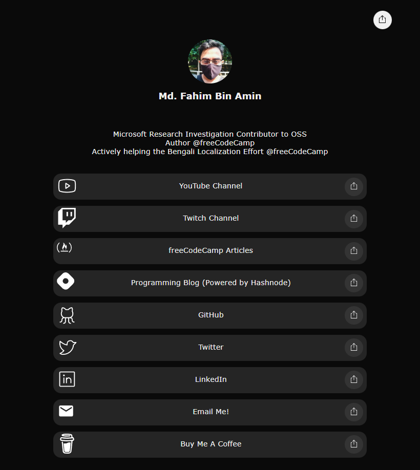

# LinkTree Customizable Clone

On January 2023, I was thinking about creating a very simplified website for my [main domain](https://www.fahimbinamin.com/), and I was thinking creating of something like my [LinkTree](https://linktr.ee/FahimFBA) profile. There is no other way other than creating something like that on my own, right? Luckily, I have got amazing content from Ania recently for a LinkTree Clone, and that can't make me more than happier. So, I decided to make one of my own using her help. Guess what? I did it within 2 hours or so starting from making the site and customizing the nameservers and everything regarding that.

Phew! 🤗 What an amazing time it was!

## Website Preview

### Live Demo: [https://www.fahimbinamin.com/](https://www.fahimbinamin.com/)

 

---

#### Resources
* [Ania Kubów](https://youtu.be/GRgt5efpmdM)
* [SVG Icons](https://fontawesomeicons.com/svg/icons)
* A little bit of usage from my brain 😄